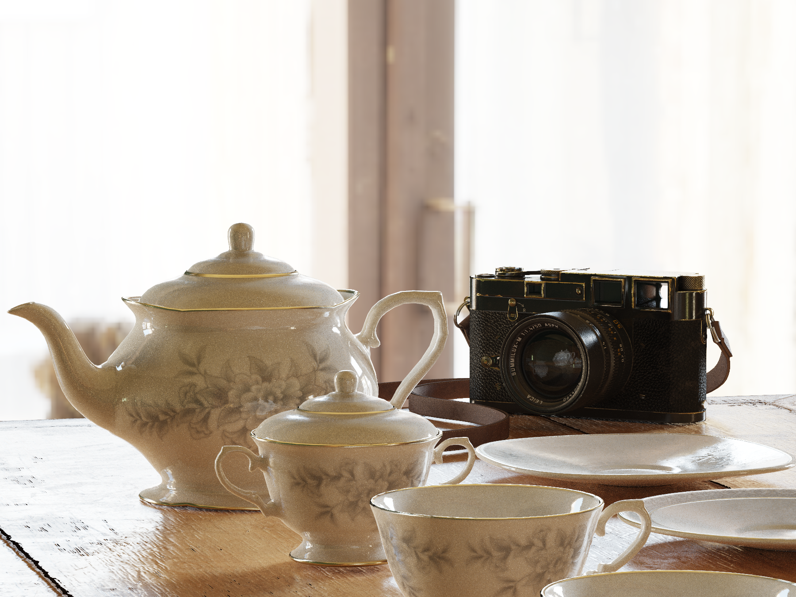
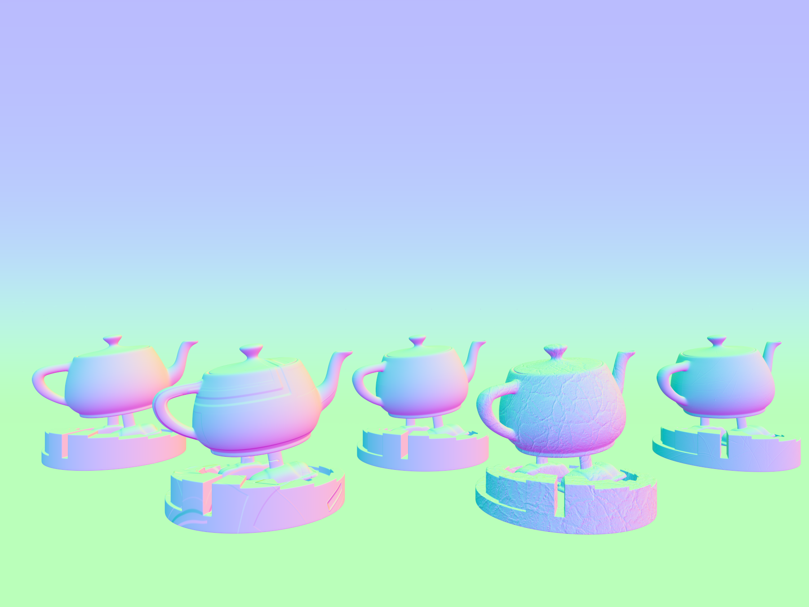
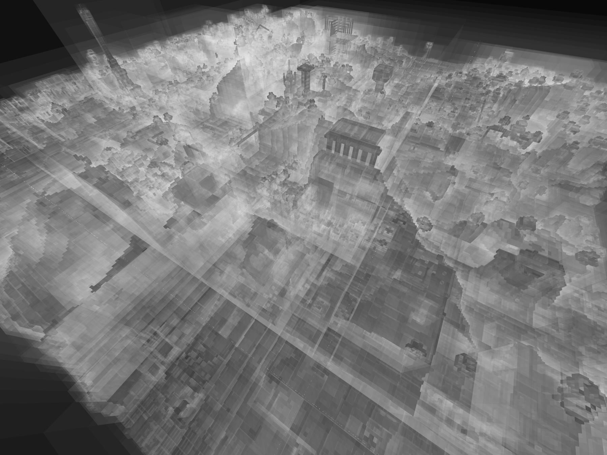

#Radish
Radish is a PathTracer implemented by CUDA and OpenGL

## Gallery

camera and tea sets

teapots with different materials

with a filmic post process and a DOF effect

glass material

teapots aperture

normal visualization

| Scene                     | BVH                 |
| --------------------------- | ----------------------- |
|  |  |

## Reference
--------
- A huge shout-out to [*UPenn CIS 565*](https://github.com/CIS565-Fall-2022/Project3-CUDA-Path-Tracer) for providing the code base.
- BVH with SAH(https://www.cnblogs.com/lookof/p/3546320.html)
- Sobol Sampling(https://zhuanlan.zhihu.com/p/20197323?columnSlug=graphics)
- PBRT-v3 (https://github.com/mmp/pbrt-v3) which provides an endless source of knowledge. The online book is a gift that keeps giving.
- Models mostly come from [*knightcrawler25*](https://github.com/knightcrawler25/GLSL-PathTracer/tree/master) and [*Poly Haven*](https://polyhaven.com/)